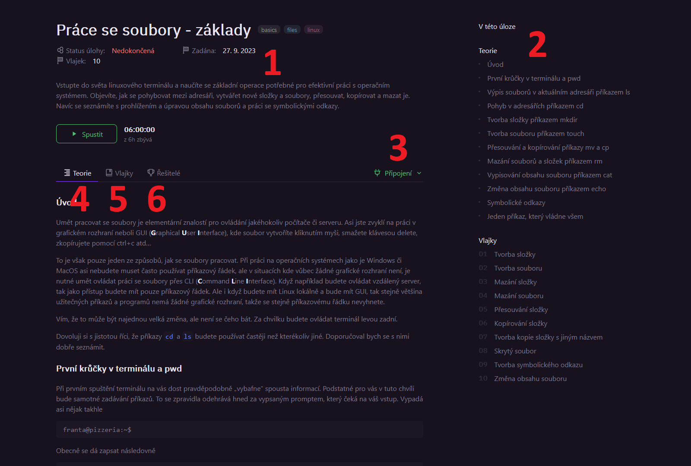

# Přehled stránky úlohy
Pro řešení úlohy je prvně potřeba si otevřít její detail. Na ten je možné se dostat několika způsoby, a to přes [stránku Přehled](/students/basics/#prehled) anebo [stránku Katalog](/students/basics/#katalog).

Detail úlohy vypadá zhruba takto (ne všechny úlohy mají nutně všechny prvky): 

Stránka se skládá z několika hlavních částí:

## 1. Infobox
Zcela nahoře se nacházejí základní informace o úloze
- Jméno
- Datum, kdy ji student dostal zadanou
- Počet vlajek
- IP adresa (u spuštěných úloh)
- Krátké shrnutí
- Tlačítko pro spuštění/zastavení
- Informace o zadaném čase a čase zbývajícím pro vyřešení úlohy.  
    ::: info
    Tento čas se počítá pouze, když úloha běží.
    :::

## 2. Přehled
V pravé části se nachází seznam nadpisů v Teorii a seznam vlajek. Pro rychlejší nevigaci úlohou je možné na libovolnou vlajku nebo nadpis kliknout a stránka se posune na odpovídající místo.

## 3. Připojení
Vpravo od záložek Teorie, Vlajky a Řešitelé se nacházejí informace o připojení k úloze. Ty se otevírají kliknutím na text 🔌 Připojení.

Zde si v horní části popupu může uživatel zvolit způsob připojení. Dostupné způsoby budou zaviset na úloze, nejčasteji zde bude SSH a HTTP, může se zde ale vyskytnout třeba VPN, TCP nebo i možnost Jiné, kde bude další popis kroků k připojení.

::: details SSH a HTTP připojení
K úlohám, které se řeší v příkazové řádce se většinou připojuje pomocí SSH.

Velmi často takové úlohy mají i alternativní možnost připojení, a to přes HTTP. Po přejití na vypsanou URL se otevře webová stránka, která simuluje příkazovou řádku. Toto je užitečné zejména na zařízeních, kde není možné použít příkazovou řádku, nebo která nemají SSH a není mmožné ho nainstalovat (např. některé školní počítače).
:::

Dále je zde možnost zkopírovat IP adresu zařízení, na kterém je úloha, nebo rovnou i celý příkaz na připojení. (Opět záleží na dostupných typech přístupu, podle úlohy.)

Můžete si povšimnout, že naprosté většině případů jsou IP adresy ve formátu `192.168.30.x`. To znamená, že to jsou adresy ze soukromého rozsahu a nejsou dostupné volně z internetu. K připojení na takové úlohy je třeba být připojen na HAXAGON VPN. Více informací o nastavení je na [stránce o základním používání platformy](/students/basics/#vpn-konfigurace).

> K většině z úloh je možné se **připojit přes veřejnou IP adresu**. Po zakliknutí této v sekci *Připojení* možnosti (pakliže není vybrána jako výchozí) **není nutné být připojený na VPN**.

## 4. Teorie
V prostřed stránky se nacházejí 3 záložky, které obsahují hlavní náplň stránky.

V záložce Teorie jsou teoretické informace k řešení úlohy. U úloh pro výuku zde bude zpravidla vysvětlená látka, které se úloha věnuje.

U testových úloh a u úloh v soutěžích často záložka Teorie chybí a místo toho je krátký doporovodný text přímo v záložce Vlajky.

## 5. Vlajky
Zde se řeší a odevzdávají jednotlivé dílčí úkoly úlohy, tzv. vlajky.

Jméno pochází z CTF (Capture The Flag) soutěží, kde se hledají právě různé vlajky. Zde je stejně řešený jeden typ vlajek, a to ty textové. Více o typech vlajek dále.

V záložce vlajky může být nahoře krátký text doplňující informace k řešení. Často to bývá kousek příběhu, který zasazuje úlohu do nějakého prostředí. Pokud je příliš dlouhé a překáží při řešení vlajek, lze toho zadání skrýt kliknutím na text "Zadání" v horní části.

Pod zadáním následuje postupně seznam vlajek, tak jak je vidět v navigaci na pravé části stránky. Každá úloha se skládá z několika částí:
- Číslo a název
- Popis, zadání k získání vlajky
- Volitelně i skryté řešení  
    Pokud má vlajka řešení dosupné pro studenty, je ho možné zobrazit a skrýt kliknutím na nadpis "Řešení" pod popisem vlajky. Zde často bývají příkazy potřebné k získání vlajky, většinou i s vysvětlením proč a jak je použít.
- Samotné pole pro odevzdání vlajky. To může být několika typů, viz dále.

Vlajky mají několik typů, podle toho, co a jak se plní/odevzdává.  
Pro splnění většiny vlajek je potřeba mít úlohu spuštěnou.

Některé typy vlajek mají u sebe daný počet pokusů. Pokud se studentovi nepodaří vložit správnou odpověď v definovaném počtu pokusů, bude se vlajka počítat jako nesplněná. Nesplněné vlajky se na rozdíl od těch nedokončených počítají do statusu úlohy - pokud jsou všechny vlajky Správně, nebo Špatně, označí se celá úloha jako "Dokončená". Dokončené úlohy se poté zobrazují na stránce [Přehled](/students/basics/#prehled) v jiném sloupci. Pokud je úloha dokončená, ale má některé vlajky nesplněné, odráží se to na procentuálním skóre na stránce Přehled.

Pokud studentům dojdou pokusy, mohou požádat svého vyučujícího, aby jim neúspěšná odevzdání smazal. Ten posoudí, zda je to vhodné, podle typu úlohy a odevzdaných vlajek. Mazání odevzdání je dále popsáno v [učitelské sekci](/teachers/basics/#resetovani-vlajek).

### Textové vlajky
Jeden z nejběžnějších typů vlajek.

Pro vyřešení je třeba najít určitý text, podle popisu vlajky, a odevzdat ho do políčka ve vlajce.

Často se očekává text ve formátu `haxagon{text_vlajky}`, ale také občas ne, je tudíž nutné pozorně číst popisy vlajek.

### Výběr z možností
Tento typ vlajek je hodně využíván v testech a kvízech. Pro odevzdání stačí začkrtnout správnou odpověď a kliknout na tlačítko "Odeslat".

### Automatické vlajky
Další velmi častý typ vlajek. Tyto vlajky fungují tak, že se na zařízení, na kterém běží úloha, periodicky spouští nějaký příkaz, který kontroluje, zda jsou všechny požadavky pro splnění vlajky splěny.

Tento typ vlajek nemá na rozdíl od předešlých dvou povolený počet pokusů, pokouší se splnit, dokud se to nepodaří.

### Trigger vlajky
Méně častý typ vlajky, ale funguje velmi podobně jako Automatické vlajky. Jediným rozdílem je, že se kontrolovací příkazy spouští až po kliknutí na tlačítko, tudíž se používá na kontrolu složitých věcí, které by zbytečně zatěžovaly systém, pokud by se prováděly neustále.

## 6. Řešitelé
V poslední záložce se nachází seznam uživatelů z aktuální skupiny, kteří již úlohu vyřešili, spolu s body, které zatím získali.

Toto zobrazení se liší od [Žebříčku](/students/basics/#zebricky) tím, že je zde lépe vidět, jak se komu na úloze daří.
